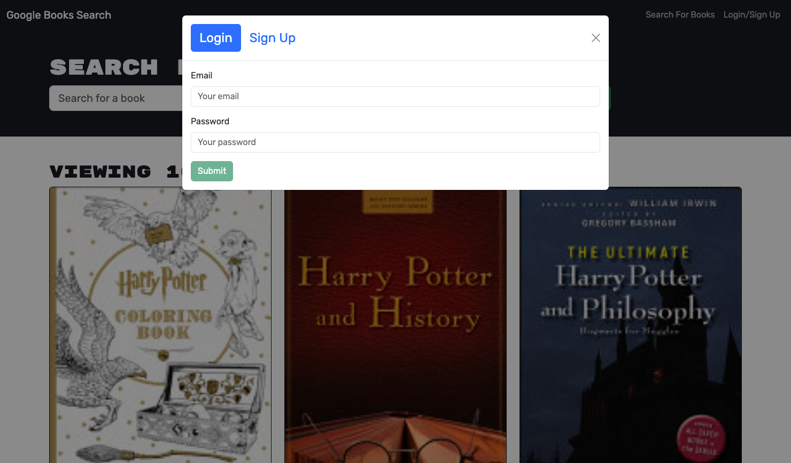
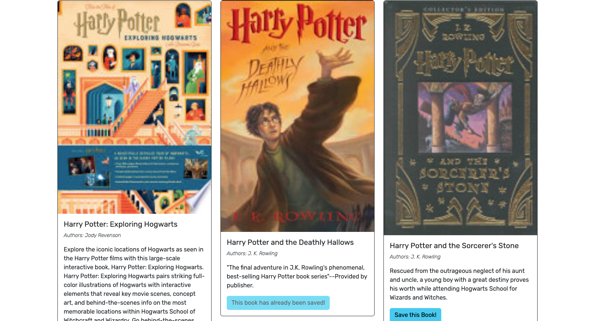

# Book Search Engine

## Description

The Book Search Engine is a project that is designed to provide avid readers with the ability to search for new books to read and maintain a list of books they wish to purchase. This project consists of a web application that allows users to perform book searches, save books to their account, view their saved books, and manage their account through a login/signup system. The project was originally built with a RESTful API and got refactored to be a GraphQL API built with Apollo Server.

## Usage

You can use the application by entering the url: into your browser.

You will be presented with a menu with two options:

- Search for Books: Allows you to search for books using a search field and submit button.
- Login/Signup: This option opens a modal with a choice to log in or sign up.
If you are not logged in, you can enter a search term in the input field and click the submit button to see search results. Each result will display a book's title, author, description, image, and a link to that book on the Google Books site.

You can create an account by selecting the "Signup" option in the modal. You will be prompted to provide a username, email address, and password. After signing up, you will be logged in automatically.

If you already have an account, choose the "Login" option in the modal, enter your email and password, and click the login button to access your account.

Once you are logged in, the menu options will change to "Search for Books," "My Saved Books," and "Logout."

When searching for books while logged in, you will see the same search results as before, with an additional button to save a book to your account.

To view your saved books, select "My Saved Books" from the menu. Here, you will see all the books you have saved, along with the book's title, author, description, image, and a link to that book on the Google Books site. You can also remove books from your saved list.

If you wish to log out, simply click the "Logout" button, and you will be returned to the main menu.

## Credits

I checked out the [GraphQL Tutorial](https://graphql.org/graphql-js/mutations-and-input-types/) for help with mutations and input types.

## License

More details about the MIT License are available in the repository.